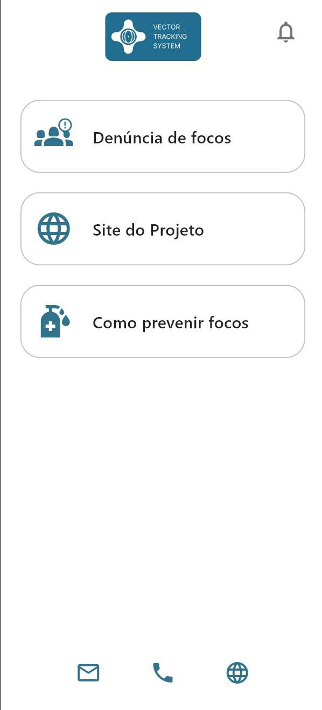

# Vector Tracking System (VTS)

Aplicativo Flutter para denúncias e prevenção de focos de vetores, como mosquitos transmissores de doenças. O app permite registrar denúncias, acessar informações do projeto e dicas de prevenção.

## Telas do Aplicativo

### Tela de Splash


### Tela Inicial (Home)



## Como executar o projeto

1. Instale as dependências:
   ```sh
   flutter pub get
   ```
2. Execute o app:
   ```sh
   flutter run
   ```

## Recursos úteis

- [Documentação Flutter](https://docs.flutter.dev/)
- [Cookbook: Exemplos Flutter](https://docs.flutter.dev/cookbook)
